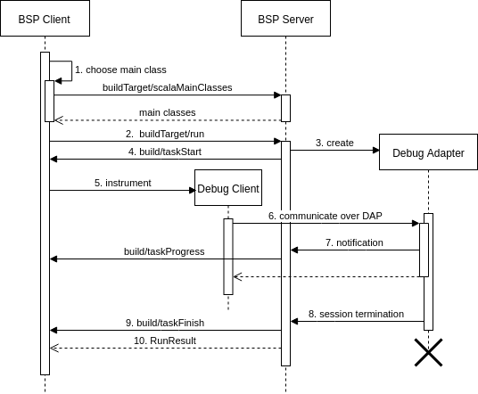
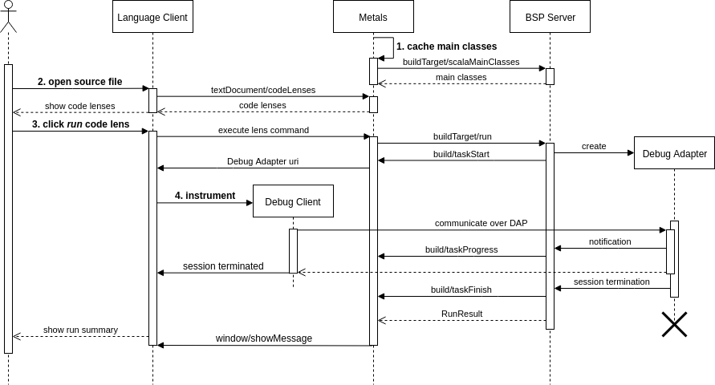

## Debug Adapter Protocol integration guide

Bloop allows the client to run and debug both the main classes and the tests defined in the project. 
This is possible thanks to the Debug Adapter Protocol, which bloop exposes to the client 
in a run/test task start notification. This adapter expects either a 
`ScalaTestClassesItem` or `ScalaMainClass` as a configuration parameter for the launch request.

### Client-Server communication

1. BSP Client chooses which main class to run. To do so, it requests the list of all runnable main classes from the BSP Server.
2. BSP Client request the chosen class to be run.
3. BSP Server sets up a new Debug Adapter. It has all the details for running, since those came in the request data field. If the request from 2. had a field debug set to true, the Adapter will be launched with full debugging capabilities. Otherwise only lifecycle-related endpoints (launch, restart, terminate etc.) will be supported.
4. BSP Server notifies the BSP Client of the Debug Adapter uri
5. BSP Client notifies the Debug Client to connect to the given uri
6. Debug Client converses with the Debug Adapter
7. Debug Adapter notifies the BSP Server of its progress. As a result it sends notifications to the Client
8. Debug Adapter notifies the BSP Server it is about to terminate
9. BSP Server notifies the BSP Client the run task has finished
10. BSP Server responds to the BSP Client with the run result of request from 2.

### Example: [metals](https://github.com/scalameta/metals) integration

Metals is an interesting case of BSP client. 
It is acting as a language server therefore it must allow the language client to handle the Debug Client. 

1. Metals caches the available main classes.
2. User opens a source file. As a result, Language Client asks metals for code lenses, which are resolved using the cached main classes metadata.
3. User clicks on the code lens with the intention to run the specific main class. Metals requests a Debug Adapter uri from the BSP Server and then passes it back to the Language Client.
4. Language Client instruments the Debug Client to connect to this Debug Adapter
