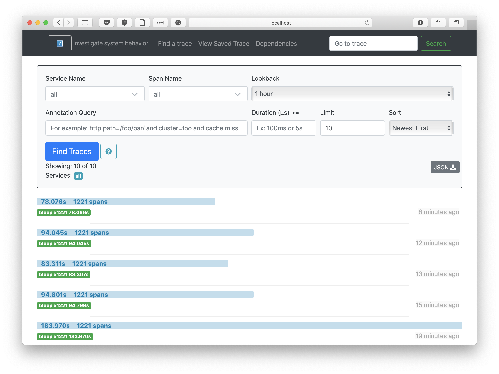
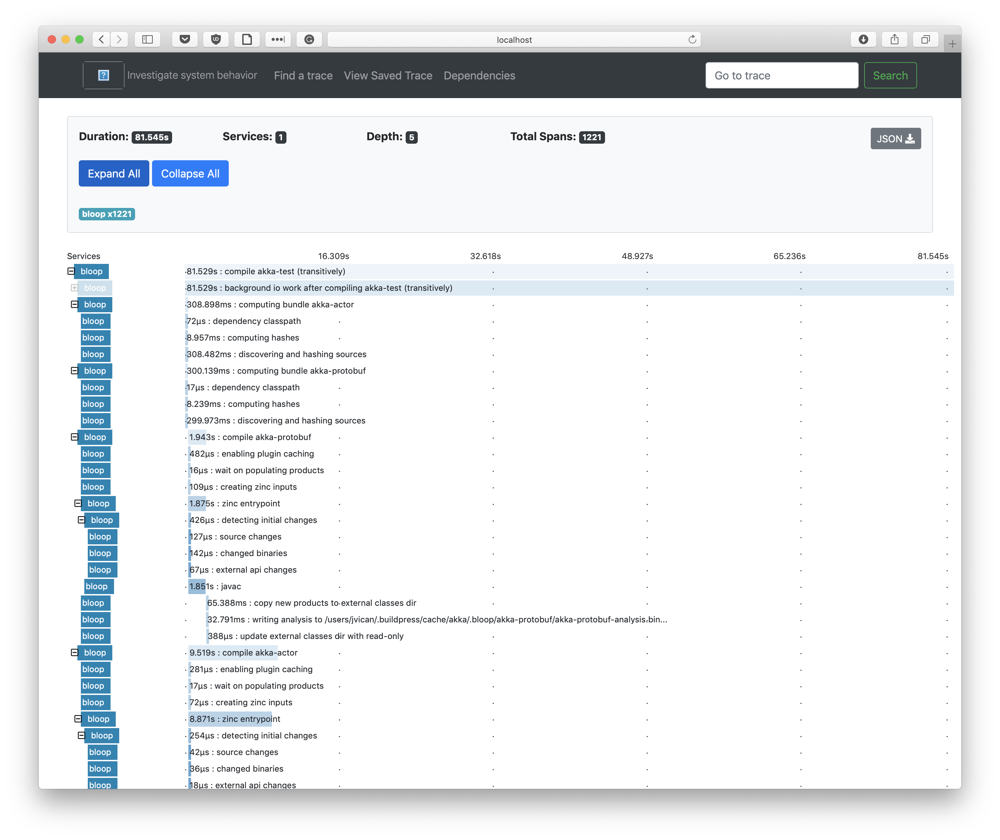

A major goal of Bloop as a build server for the [Scala programming
language](https://scala-lang.org/) is to be as fast as possible, by default,
with no sacrifices in correctness or compromises in user experience. In spite
of these constraints, Bloop is in fact as fast as or faster than the most
popular build tools in the Scala ecosystem.

However, it is easy to go astray without an appropiate set of tools that
identify regressions and measure build performance objectively. Builds stress
their use of a toolchain uniquely, so it is necessary these tools are not
only used during development but by users wishing to keep their build
performance in check.

This guide explains the tools Bloop provides users to:
  
1. Get familiar with the performance characteristics of project builds
1. Compare the performance of Bloop with that of other tools compiling Scala code
1. Modify a complicated build to optimize build times

> For the moment, this guide focuses mostly on compilation performance. In the
future, it will be expanded to cover testing and running.

## Analyze build performance characteristics

Before analyzing performance numbers analytically, let's build a precise
model of the structure of your build, its characteristics and the
consequences of those in the overall build performance. A quick way to build
such model is to use our [Zipkin](https://zipkin.apache.org) integration.

### Analyze build traces in Zipkin

Zipkin is a distributed tracing system that gathers timing data and it's
often used to troubleshoot problems in microservice architectures. Bloop
integrates with Zipkin because it:

1. [Installs quickly](http://zipkin.apache.org/pages/quickstart.html) in any system
1. Displays build traces nicely in a hierarchical web user interface
1. Allows persisting build traces to databases such as Cassandra
1. Has an extensible design to:
    1. Launch and connect to remote server instances
    1. Allow third-parties to build in-house tooling (such as analytics tools)

#### Install and run zipkin

To install Zipkin, follow the installation steps in the [Zipkin Quickstart
guide](http://zipkin.apache.org/pages/quickstart.html). After following the
guide, you should have a live Zipkin instance running at
`http://localhost:9411/zipkin/`.

### Use case: [akka/akka](https://github.com/akka/akka)

We can obtain some compilation traces for the `akka` project by:

1. Installing and running Zipkin as described above
1. Compiling the `akka/akka` build with Bloop right away

A Bloop server restart is **not** required because Bloop will detect Zipkin
running in the default localhost address automatically and enable tracing.
You can point to another local or remote Zipkin server by setting the url to
the `zipkin.server.url` system property. This last operation does require
restarting the server.

The image above shows the Zipkin UI after tracing some full compilations of
`akka` in commodity hardware. Note that we have sorted by "Newest First", so
the higher a trace is the more recent it is. We clearly see the JIT inside
the Bloop server getting hotter and hotter with every iteration.

However, how can Zipkin help us create a precise model of our build? Let's
click on a trace to find out.

The hierarchical UI of the traces help us visualize, among others:

1. What the completion time of every task is
1. What are the dependencies among all Bloop tasks
1. What are the number of tasks running in parallel at any given point
1. What is the dependency graph of your build
1. Which projects are blocked by others

Having visual help to answer these questions is invaluable to get a feeling
of what we're optimizing and what can be optimized. For many of us,
visualizing is the path to understanding!

If you don't know where to start, browse all the running tasks and look for
surprising behaviours in your build. This is a great way to start asking
questions and spot build invariants slowing down compilation times.

The Zipkin UI is rich and featureful with lots of filtering and inspection
capabilities. It's recommended you play around with the UI to know how to
effectively use the build traces to step up your profiling game.

## Prepare to run the benchmarks

Build traces are a great way to visualize build timings and spot expensive
tasks. However, we sometimes want a more precise and granular way of
reasoning about our build performance.

This precision is often required when we're making changes to our builds for
the sake of performance and we want to show our team how good the change
we've implemented is. For that, we need a reliable numerical analysis where
we control for variables such as error in our measurements or a mechanism to
compute statistical data such as average time and percentiles.

To benchmark Bloop in your build, Bloop provides a
[JMH](https://openjdk.java.net/projects/code-tools/jmh/) battery of
benchmarks you can run in your build as well as several other benchmarks for
other build tools such as sbt.

If you're going to go the extra mile to collect reliable benchmark data,
let's remember a few best practices to keep in mind before jumping to running
the benchmarks.

### Control the benchmark environment

Benchmark data is as good as your system setup to minimize noise is.

If the machine where you run the benchmarks is used by other process, is not
correctly configured to reduce noise or doesn't compile your project with
certain degree of reproducibility, invest time to stabilize it.

1. Disable NUMA.
1. Disable Turbo Boost and set CPU frequency manually.
1. Disable the cron scheduler or similar applications.
1. Keep the running background process to a bare minimum.
1. Tweak operating system details to avoid virtual memory issues, avoid lazy IO, etc

> Take some inspiration from [this Bash script we use for our Linux
> benchmarking machine](https://github.com/scalacenter/compiler-benchmark/blob/bloop/scripts/benv).

It's legit to ignore any of these steps if, for example, the impact of your
changes would be higher by enabling NUMA/Turbo Boost or you want to collect
more "realistic" benchmark data that ressembles better the noisy machines
developers compile in.

Remember, performance is not composable!

### Compare apples-to-apples

It's *really* important that you know what you're comparing and how.

Please think carefully about it before running any benchmarks, especially if
you intend to compare the benchmark numbers with those from another tool.

For example, a common mistake is to benchmark Bloop after importing the build
with Metals and then compare the results with compilation numbers from say,
gradle or sbt.

When Metals imports a build or connects to Bloop, it changes scalac options
and adds compiler plugins that can slow down compilation considerably. So, if
you are comparing numbers in this scenario, you **are not** comparing
apples-to-apples.

Even when comparing Bloop with other build tools, it's important to realize
that Bloop has a head advantage with regards to other tools as it's a highly
optimized server for only three build tasks whereas other build tools enable
you to do much more.

Put your numbers into perspective when comparing, for example, the
performance of no-op compilations, the time to warm up a hot compiler or the
time to compile your whole build. Bloop can be faster at compiling, testing
or running but if your developer workflow doesn't require any of those often,
then maybe it's not a good fit for you.

Remember, be aware you benchmark the same thing and check that build
definitions are unchanged!

## Benchmark compile times in your build

### Set up the benchmark suite

Bloop JMH benchmarks are not yet published in Maven Central. You first need
to follow the [CONTRIBUTING guide](docs/contributing-guide.md) to set up the
Bloop repository.

Then, checkout the version of Bloop you want to benchmark with `git checkout
v$BLOOP_VERSION`. Unless you manage your own Bloop version internally, you
should always default to the latest release version.

The benchmarks are located in the `benchmarks/` directory and can be run via
the `sbt-jmh` setup in Bloop's build. You can navigate to `HotBloopBenchmark`
to have a look at the source code of the benchmark. By default, the JMH
benchmark launches a new JVM to benchmark compilations with a specific set of
standard JVM options.

### Use case: [akka/akka](https://github.com/akka/akka)

#### Run benchmarks for bloop

Here's a list of the steps to benchmark `akka/akka`:

1. Remove all projects in `bloop-community-build.buildpress` and add your
   project coordinates.
   * For example, we add akka with a line like `akka,https://github.com/akka/akka.git#74ad005219770552d0a7c72c61394f88ebae3b13`.
1. Run `sbt exportCommunityBuild` in Bloop's sbt build.
   * `exportCommunityBuild` invokes `buildpress`, a tool that given a URI in
     your file system it attempts to export the project. It currently only
     supports sbt.
   

   > If you cannot use buildpress because your build tool is not sbt, the
   > process to extract your build to sbt requires manual intervention or
   > your project is not available in a git URI, then modify
   > `HotBloopBenchmark` and configure `configDir` to point to the `.bloop`
   > directory of your build.

   * When buildpress is done, it will have cloned and exported your project
     under `$HOME/.buildpress/cache`.
1. `benchmarks/jmh:run .*HotBloopBenchmark.* -wi 7 -i 5 -f1 -t1 -p project=akka -p projectName=akka-test`
   * It runs the bloop benchmark on the akka/akka build.
   * It runs 7 warmup iterations and 5 benchmark iterations.
   * It only runs the benchmarks once (one fork).

Wait for JMH to finish the benchmark and analyze its results!

If you have any questions regarding the benchmark infrastructure, come ask us
in [our Gitter channel](https://gitter.im/scalacenter/bloop).

#### Compare performance numbers with sbt

You can use the `HotSbtBenchmark` to compare performance numbers between
bloop and sbt.

#### Compare performance numbers with other tools

You can copy-paste and modify an existing benchmark to benchmark
compilation in your favorite build tool.

#### Grafana support

Our benchmark suite can send benchmark data points to Grafana. Look at the
source code of our benchmarks and [our benchmark
script](https://github.com/scalacenter/bloop/blob/master/bin/run-benchmarks.sh)
which uses a class called `UploadingRunner` to save benchmark data points.

## Speed up complicated builds

Once you're done benchmarking, you might have no idea where to start
optimizing your build, even after looking at Zipkin build traces for a few
minutes. "Sure, typechecking takes a long time, but what can I do to fix
that?" or "Can I even optimize that expensive IO task" might be questions
popping up in your mind.

That's normal, it takes time and experience to know which patterns
you should be looking for. Don't feel daunted by the task; after all,
practice makes perfect.

In this section, I want to elaborate on a few of actionable items I've used
in the past to speed up large, complicated builds using lots of advanced
Scala features. Hopefully, these actions will speed up your build too or
inspire you to get you started optimizing it.

### Use the latest Scala version

I cannot stress this enough, keeping up with the latest Scala version is
critical to have a speedy build.

Many of the optimizing features we add in the compiler or in Bloop are only
enabled in the latest releases and need each other, so the best way to ensure
your build is as fast as it can be is by upgrading to the latest Scala
version. For example, if you are using 2.11.11 while compiler developments
happens in 2.13.0, you're most likely missing out on a lot of life-quality
performance improvements.

### Use appropiate Java options

### Tweak or change VM options

### Reorganize your build graph

### Watch out for long typechecking times

### Define all macros in a single, independent project

###
